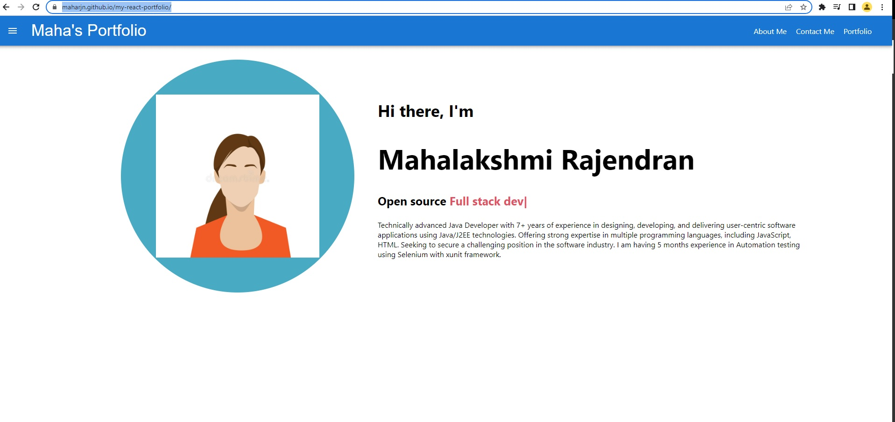

# My React Portfolio

## Table of Contents
* [Description](#description)
* [Application Demo](#application-demo)
* [Installation](#installation)
* [License](#license)
* [Contributing](#contributing)
* [Github Link](#github)
* [Reach me for any additional queries](#email)

## Description
This is my portfolio created with React.js. It contains an About page, Portfolio page, Contact page.
The Portfolio page contains a list of few projects that was developed as part of UWA Bootcamp course.

## Application Screenshot
The following screenshot shows the Home page of the Portfolio

## Installation
Run the following at the command line
    - npm install
If you get the double cursor issue, run the below command to fix the issue.
    -npm install ityped
Run 'npm start' to start the server

## License

## Contributing
 Mahalakshmi Rajendran

## Github
Visit my github profile here: [Maharjn](https://github.com/Maharjn)

## Email
Email me with any questions : maharajendran.89@gmail.com
